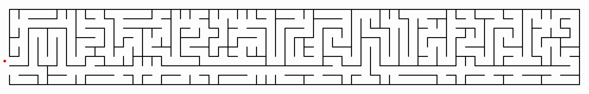
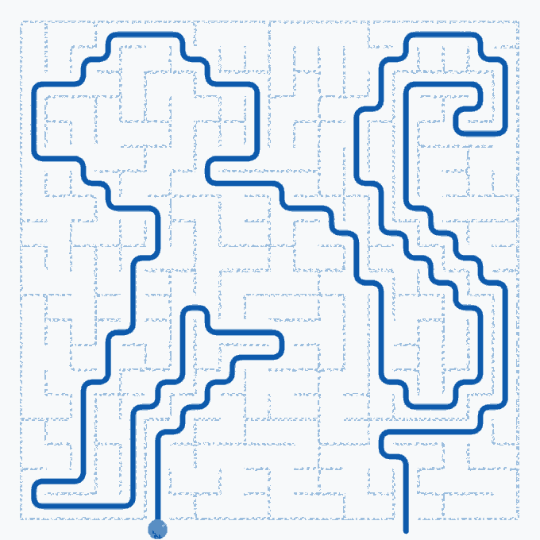
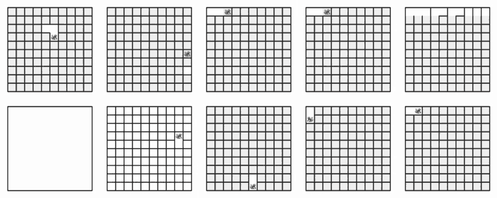

**Maze architect** is a powerful, browser-based maze generator built for visual precision and artistic control. 

**Maze Architect** allows you to generate mazes using 10 different algorithms, trace custom solution paths over imported reference images, customize routing physics, and export pixel-perfect bitmaps or optimized vectors for plotters and laser cutters.

## 🚀 Live App

[Open Maze Architect](https://andrematomer.github.io/maze-architect)

## ✨ Features

*   **10 Generation Algorithms:** From the river-like flows of Recursive Backtracking to the uniform spread of Wilson's Algorithm. Watch them generate live with adjustable animation speeds.
* **Custom Path Editor & Tracer:** Draw your own solution line first, and let the maze generate around it. You can even **import a reference image** (scale, stretch, or fit) to trace specific shapes or hidden messages into your maze.
* **Interactive Auto-Solver:** Drag and drop the start (🐒) and end (🍌) points anywhere on a generated maze to instantly calculate the path.
* **Advanced Path Routing:** Render your solution lines in multiple styles:

  <table>
    <tr>
      <td>
        
      </td>
      <td>
        <ul>
          <li><strong>Grid:</strong> Strict 90-degree center-to-center lines.</li>
          <li><strong>Smooth Turn:</strong> Perfectly rounded corner pipes.</li>
          <li><strong>8-Directions & Natural:</strong> Organic, sweeping curves.</li>
          <li><strong>String Pull:</strong> A mathematical "Funnel Algorithm" that pulls the path tight around the physical corners of your custom wall thickness.</li>
        </ul>
      </td>
    </tr>
  </table>

* **Appearance Engine:** Fully customize wall thickness, path thickness, hex colors, and rounded line caps.
 
*   **Professional Exports:** 
    *   **Optimized SVG:** Includes a "Greedy Line Merger" that combines straight wall segments into single paths, drastically reducing file size for pen plotters.
    *   **High-Res PNG:** Crisp, thick-line exports matching your visual settings.
    *   **Pixel-Perfect PNG:** Downloads raw 1px wall / 3px floor bitmaps with zero anti-aliasing.
    *   *Supports Transparent Backgrounds across all formats.*
*   **Post-Processing (Braid Mazes):** Randomly erode walls to create loops and alternate routes, turning a "perfect" maze into a "braid" maze.
*   **Unlocked Grid Sizes:** Build massive mazes (1000x1000+). Includes a safety lock to prevent accidental browser crashes, which can be bypassed if you have the hardware to handle it!

## 🧠 Included Algorithms

We provide a variety of mathematical approaches to maze generation, simplified:

1.  **Recursive Backtracker:** "River-like." Long, winding passages with few dead ends.
2.  **Hunt & Kill:** Similar to Backtracker but creates twistier layouts and is safer for massive grids.
3.  **Randomized Prim’s:** "Lightning-like." Branches out quickly from the center with many short dead ends.
4.  **Randomized Kruskal’s:** "Puzzle-like." Randomly connects walls until a maze forms; produces a very uniform look.
5.  **Aldous-Broder:** "The Drunkard." A random walker stumbles around until it visits every cell. (Slow on large grids).
6.  **Wilson’s:** "The Loop Eraser." Unbiased and uniform like Aldous-Broder, but much faster.
7.  **Recursive Division:** "The Chamber." Starts with an empty room and slices it into smaller sections. Distinct "blocky" look.
8.  **Eller’s:** "The Infinite Scroll." Generates row by row; highly memory efficient.
9.  **Sidewinder:** "The Wind." Generates row by row with a strong vertical wind bias.
10. **Binary Tree:** "The Slope." Extremely fast, but every corridor leads diagonally (North-West bias).

## 🛠️ How to Run Locally

Because this project uses ES6 Modules (`type="module"`), modern browsers block opening it directly via `file://` due to CORS security. 

To run it locally, use a simple local web server:
*   **VS Code:** Install the "Live Server" extension and click "Go Live".
*   **Python:** Open your terminal in the folder and run `python -m http.server 8000`, then visit `http://localhost:8000`.
*   **Node.js:** Run `npx serve`.